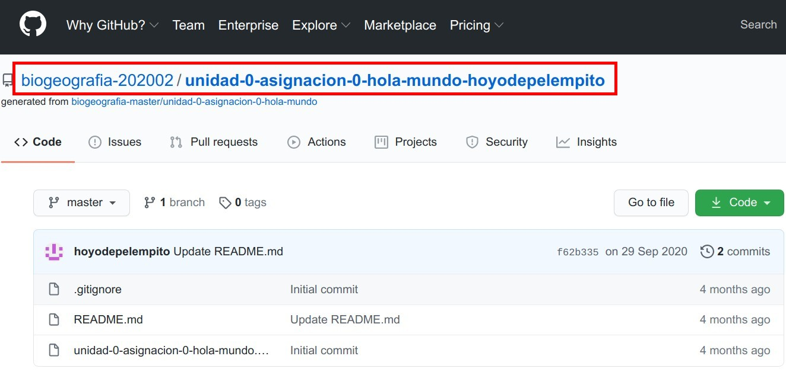

# Hola Mundo

> "Sin embargo, el mundo nunca responde"

**Por José Ramón Martínez Batlle**

Probemos que GitHub funciona.

## Clonar el repo

Si estás leyendo este texto, es muy probable que hayas aceptado una invitación (enviada mediante correo o foro) para clonar el repo "Hola Mundo" de esta asignatura, por lo que te encuentras en una instancia que lleva el nombre `biogeografia-202101/unidad-0-asignacion-0-hola-mundo-tuusuariodegithub`. Mira un ejemplo del usuario `hoyodepelempito` de la edición 2020-02:

<figure>
    
    <figcaption>*Ejemplo de repo ya clonado*</figcaption>
</figure>

 

En caso contrario, haz lo siguiente. 

1. Abre una pestaña del navegador e inicia sesión en GitHub.

2. Ve al canal `Asignaciones` del foro de la asignatura, localiza un mensaje con el asunto `unidad-0-asignacion-0-hola-mundo` (es el primero de dicho canal), copia la URL de la asignación y pégala en la pestaña del navegador donde abriste tu cuenta de GitHub.

3. Acepta la invitación correspondiente. Tras aceptar, se generará tu instancia del repo.

Ante cualquier inconveniente, avísame por el foro o escribe a mi correo.

## Haz una modificación a tu repo

Tan pronto hayas verificado que estás trabajando en tu repo, haz una modificación.

1. En tu repo, desde GitHub, haz clic sobre el nombre de archivo `README.md`, que es precisamente el que contiene este texto.

2. Haz clic en el lápiz de edición de la parte superior del archivo para entrar al modo edición.

3. En modo edición, escribe tus nombres y apellidos, sustituyendo los puntos suspensivos que verás a continuación por tu respuesta:

  * Tu respuesta aquí: ...
  
4. Al finalizar, ve al fondo y presiona `Commit changes`.
